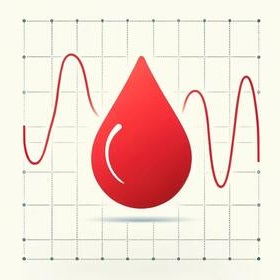
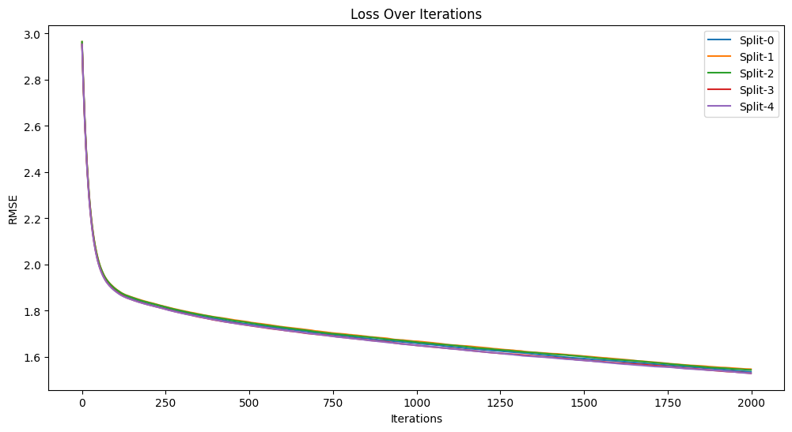
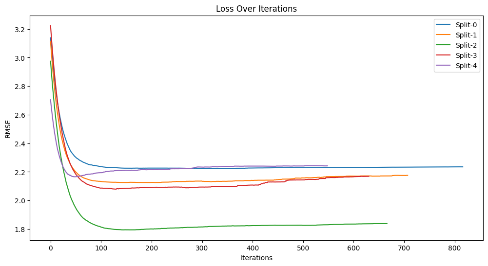
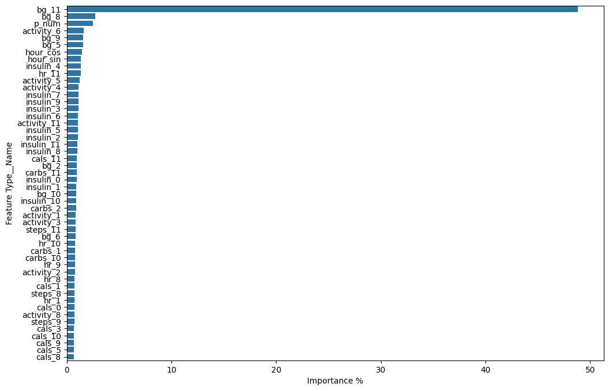

    

        
    

    

         
    

    <h1>BrisT1D Blood Glucose Prediction</h1>

Accurately predicting **blood glucose fluctuations** is a game-changer for managing **type 1 diabetes**. Innovative algorithms can significantly reduce the daily challenges faced by individuals with this condition. This project aims to harness the power of **machine learning** to forecast blood glucose levels one hour ahead using participant data from the previous six hours, collected via **T1D devices** and **smartwatches**.

## 🎯 **Problem Statement**
Type 1 diabetes management is complex and requires precise predictions of blood glucose levels to prevent complications. Our primary goal is to create a model that can predict blood glucose levels one hour into the future based on historical data from continuous glucose monitors, insulin pumps, and smartwatches. This could help automate and optimize diabetes management.

## 📊 **Dataset Description**
The dataset is a real-world collection from young adults in the UK who have type 1 diabetes, provided by the [Jean Golding Institute](https://www.bristol.ac.uk/golding/). All participants wore continuous glucose monitors, used insulin pumps, and wore smartwatches to collect activity data. The dataset includes:
- **Blood glucose readings**
- **Insulin dosage**
- **Carbohydrate intake**
- **Activity data** (e.g., steps, heart rate, calories burned)

Data is aggregated into five-minute intervals, capturing six hours of history to predict glucose levels an hour ahead. After the competition, the complete dataset will be available for research purposes. Read more about the study in [this blog post](https://jeangoldinginstitute.blogs.bristol.ac.uk/2024/08/19/how-smartwatches-could-help-people-with-type-1-diabetes/).

### 📁 **Synthetic Dataset**
A synthetic dataset mirroring the original data's structure and distribution is provided for demonstration purposes. Access it at `resources/synthetic_dataset.csv`.

### 📜 **Dataset Columns**
Here's a breakdown of the columns in the dataset:
- **`id`**: Row ID (participant number and count)
- **`p_num`**: Participant number
- **`time`**: Time of day (HH:MM:SS)
- **`bg-X:XX`**: Blood glucose reading (mmol/L) from X:XX (HH:MM) in the past
- **`insulin-X:XX`**: Total insulin dose received in units in the last 5 minutes from X:XX in the past
- **`carbs-X:XX`**: Total carbohydrate intake in grams in the last 5 minutes from X:XX in the past
- **`hr-X:XX`**: Mean heart rate in bpm in the last 5 minutes from X:XX in the past
- **`steps-X:XX`**: Total steps walked in the last 5 minutes from X:XX in the past
- **`cals-X:XX`**: Total calories burned in the last 5 minutes from X:XX in the past
- **`activity-X:XX`**: Self-declared activity performed in the last 5 minutes from X:XX in the past
- **`bg+1:00`**: Blood glucose reading (mmol/L) one hour in the future (the target variable)

## 📝 **Results**
Training the predictive model provided significant insights on the possible approaches to blood glucose prediction.  
Early feature importance analysis has shown that the prediction is influenced only by data at most 1 hour in the past. 
We can seize this opportunity to change the problem statement and increase our dataset size by 6 times.

### 🏆 **Competition Result**
The model was tested against an unseen set of data, with 15 new patients, and scored RMSE 2.5664 on [this](https://www.kaggle.com/competitions/brist1d/overview) competition.  
This performance is just 0.1653 RMSE away from the top solution in terms of accuracy.

### 📉 **Cross validation Loss Graph**
Cross validation RMSE loss shows homogeneous accuracy of ~1.537 over all 5 folds.

By Leveraging Grouped KFolds by patient number, we can evaluate model accuracy over each patient.

### 🌟 **Feature Importance**
The feature importance graph highlights the most influential factors in predicting blood glucose. This allows us to identify key contributors and understand which variables have the most significant impact on our model's predictions.

